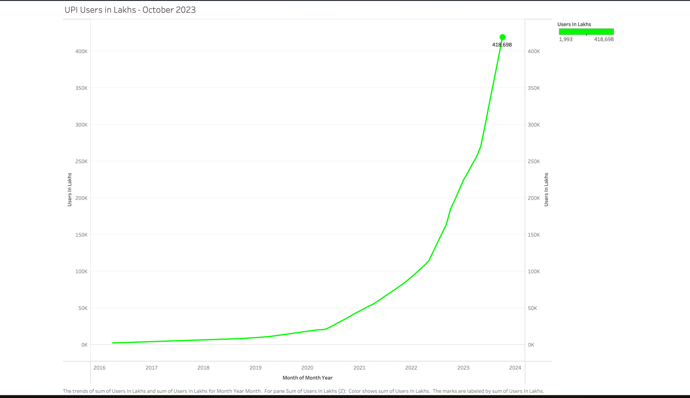
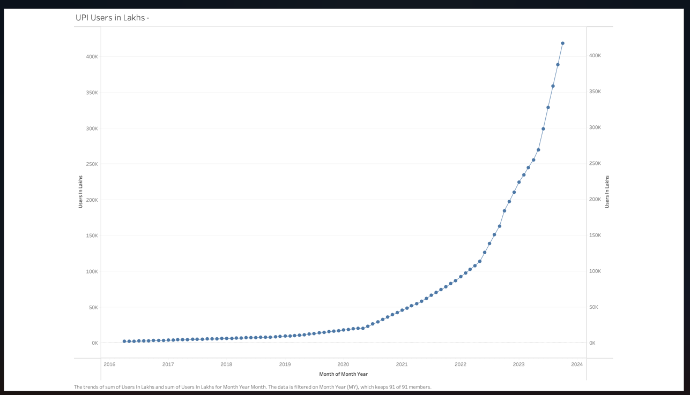
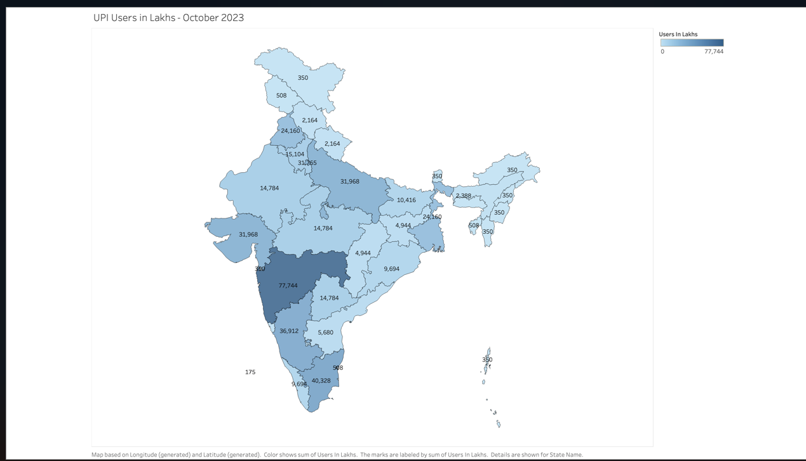
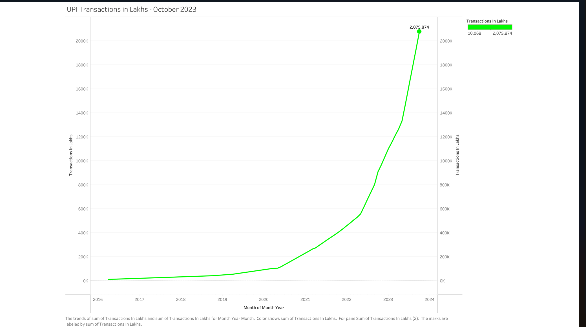
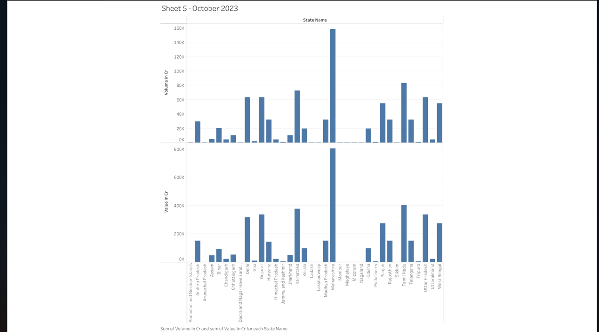
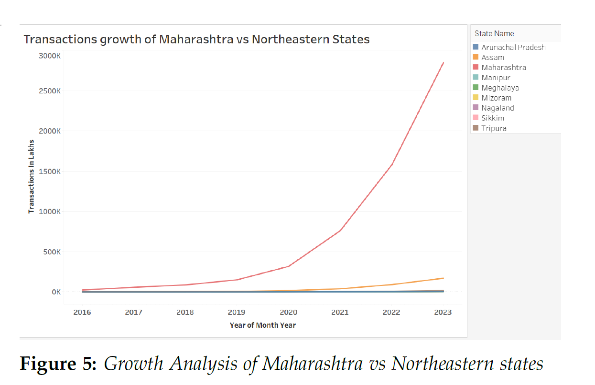

# Understanding India’s Digital Commerce via UPI Data

> 📅 Timeline: April 2016 – October 2023  
> 🧠 Team: Aman Ostwal, Darshit Rai, Sanskruti Ajay Chavanke, **Ram Kishore KV (Lead Contributor)**, Sai Pokuri  
> 🏫 Drexel University  
> 📄 Date: December 14, 2023  

---

## 📌 Abstract

This project explores India's digital commerce landscape through Unified Payments Interface (UPI) data. Spanning over 7 years, we analyze transaction volumes, user bases, and frequency across Indian states to uncover macro- and micro-level trends. These insights aim to assist policymakers, financial institutions, and businesses in understanding the dynamics of digital payments.

---

## 📁 Repository Structure

- Book1.pptx  
- Book1.twb  
- Book2.twbx  
- Final UPI Dataset v1 Final.xlsx  
- Final UPI Dataset v1.csv  
- Project_C.pdf  
- README.md  
- maharashtra_vs_northeast_comparison.png  
- transaction_volume_per_state_cr.png  
- user_distribution_map_india.png  
- yearwise_upi_transactions_lakhs.png  
- yearwise_user_growth_top5states.png  
- yearwise_user_growth_top5states2.png  

## 🧪 Methodology

- **Data Source**: Generated via ChatGPT & Claude for April 2016 – Oct 2023 across all Indian states.
- **Visualization Tool**: All data insights were visualized using **Tableau** (charts, maps, comparisons).
- **Focus Metrics**: Number of users (in Lakhs), Value (₹ Crores), and Frequency (monthly/annual) across states.

---

## 📊 Key Visual Insights

## 📊 Visual Insights

### 1️⃣ Year-wise UPI User Growth (Top 5 States)

**View 1:**

**View 2:**

---

### 2️⃣ India Map of UPI User Distribution

---

### 3️⃣ Yearly UPI Transactions in India (in Lakhs)

---

### 4️⃣ Transaction Volume by State (₹ Crores)

---

### 5️⃣ Maharashtra vs Northeast – Transaction Growth Comparison

---

## 🔭 Future Work

- 📉 Predictive modeling of future UPI usage
- 🕵️‍♀️ Fraud detection via anomaly analysis
- 🧠 Behavioral segmentation for fintech targeting

---

## 📄 Resources

- 📘 [Final Report – Project_C.pdf](./Project_C.pdf)
- 🎞️ [Presentation – Book1.pptx](./Book1.pptx)
- 📚 [Economic Times UPI Surge Article](https://bfsi.economictimes.indiatimes.com/news/fintech/upi-transactions-more-than-double-in-a-year-on-covid-19-shift/87476752)  
- 📖 [UPI Research Paper – IJCRT](https://ijcrt.org/papers/IJCRT22A6800.pdf)

---

## 👥 Authors

- **Ram Kishore KV** – Lead Contributor (rk999@drexel.edu)
- Aman Ostwal
- Darshit Rai
- Sanskruti Ajay Chavanke
- Sai Pokuri

---

> _"India’s digital economy is rising fast. UPI is the engine."_  
> ⭐ Star this repo if you learned something useful!
